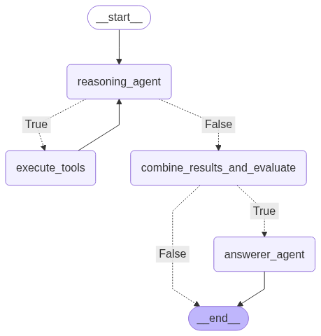

# python-langgraph-rag-api

This project implements a Retrieval-Augmented Generation (RAG) pipeline using LangGraph. It provides a chat API that can be integrated with a React-based chatbot interface.

# The graph Structure:


## Project Structure

```
python-langgraph-rag-api
├── app
│   ├── __init__.py
│   ├── main.py
│   ├── api
│   │   ├── __init__.py
│   │   └── chat.py
│   ├── core
│   │   ├── __init__.py
│   │   └── pipeline.py
│   └── models
│       ├── __init__.py
│       └── chat.py
├── requirements.txt
└── README.md
```

## Installation

1. Clone the repository:
   ```
   git clone <repository-url>
   cd python-langgraph-rag-api
   ```

2. Install the required dependencies:
   ```
   pip install -r requirements.txt
   ```

## Usage

1. Start the application:
   ```
   python app/main.py
   ```

2. Access the chat API at `http://localhost:8000/api/chat`.

## API Endpoints

### Chat API

- **POST /api/chat**
  - Request Body:
    ```json
    {
      "message": "Your message here"
    }
    ```
  - Response:
    ```json
    {
      "response": "Generated response based on the input message"
    }
    ```


## License

This project is licensed under the MIT License. See the LICENSE file for more details.